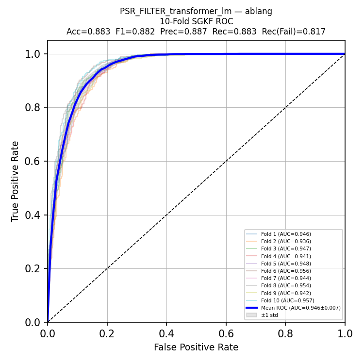
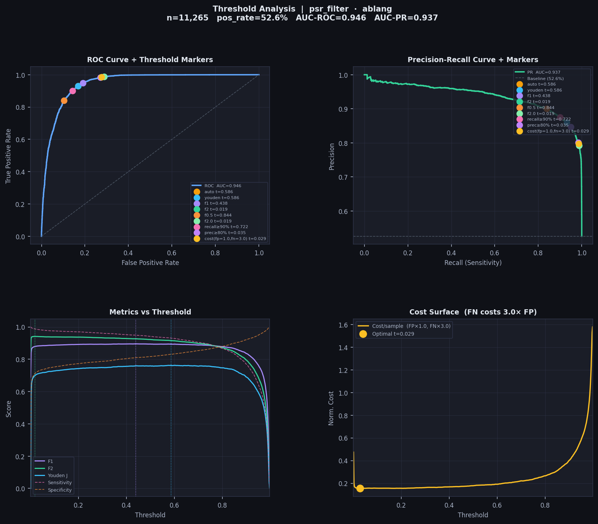
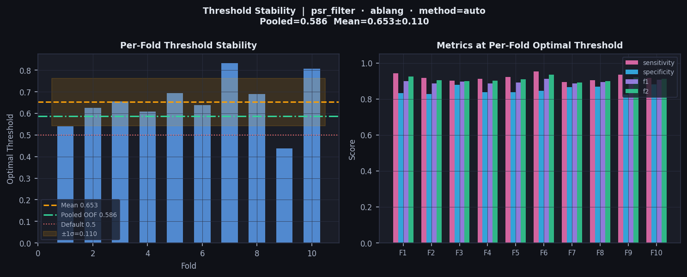
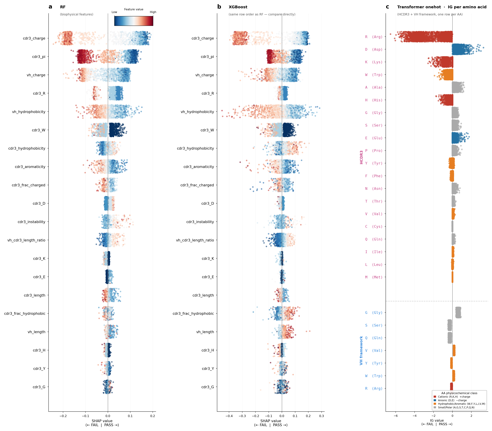
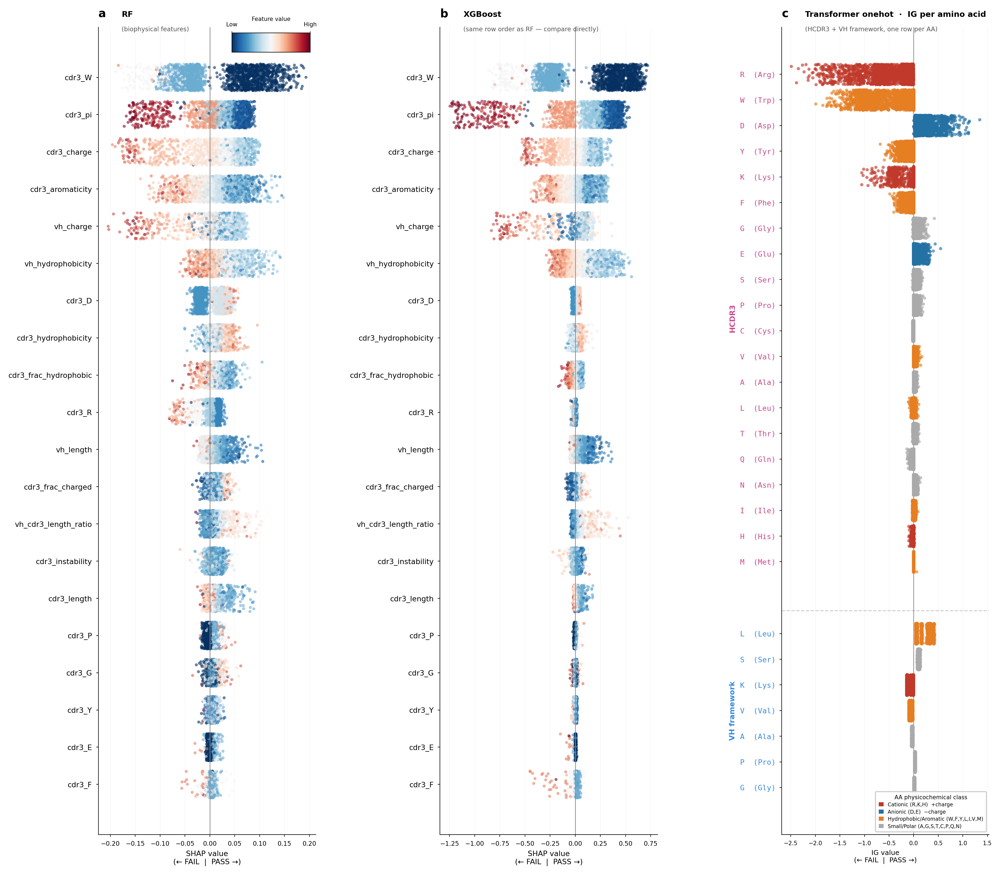
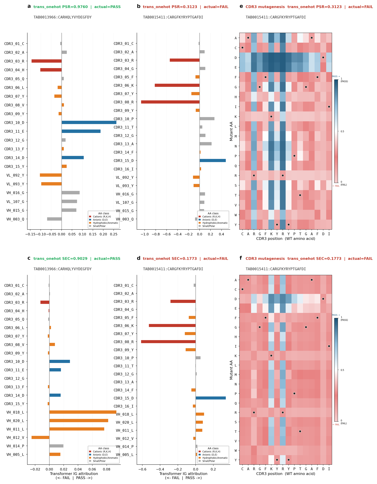

# DELPHI: Deep End-to-end Learning Platform for antibody developability with High Interpretability

<p align="center">
  
</p>

<p align="center">
  <a href="https://www.python.org/downloads/release/python-3110/"></a>
  <a href="https://pytorch.org/"></a>
  <a href="https://github.com/proteininnovation/delphi/blob/main/LICENSE"></a>
  <a href="https://github.com/proteininnovation/delphi"></a>
</p>

DELPHI is a unified interpretable machine learning framework for sequence-based prediction of antibody biophysical properties. It combines multiple classifier architectures, protein language model embeddings, automated training set curation, data-adaptive hyperparameter configuration, automated threshold optimisation, and multi-resolution interpretability within a single Python pipeline.

Applicable to any binary antibody property label including PSR (polyreactivity), SEC (size exclusion chromatography), HIC (hydrophobic interaction chromatography), AC-SINS (affinity capture self-interaction nanoparticle spectroscopy), viscosity, expression, and others.

> Code and full tutorial documentation accompanying the manuscript:
> **"DELPHI: a unified interpretable ML platform for multi-objective antibody developability prediction"**
> Hoan Nguyen, Andre Teixeira et al., *Nature Biotechnology* (in preparation)

---

## Table of Contents

- [Overview](#overview)
- [Quick Start: Three Essential Steps](#quick-start-three-essential-steps)
  - [Step 1: Install Python environment and clone DELPHI](#step-1-install-python-environment-and-clone-delphi)
  - [Step 2: Download IPI pretrained models from Zenodo](#step-2-download-ipi-pretrained-models-from-zenodo)
  - [Step 3: Run the integration test suite](#step-3-run-the-integration-test-suite)
- [Using IPI Pretrained Models](#using-ipi-pretrained-models)
- [Training Your Own Models](#training-your-own-models)
  - [Step 0: Prepare your training set](#step-0-prepare-your-training-set)
  - [Step 1: Build a balanced training set (optional)](#step-1-build-a-balanced-training-set-optional)
  - [Step 2: Pre-compute embeddings](#step-2-pre-compute-embeddings)
  - [Step 3: Cross-validate](#step-3-cross-validate)
  - [Step 4: Train final model](#step-4-train-final-model)
- [Predict on New Antibodies](#predict-on-new-antibodies)
- [Correlate with Experimental Assays](#correlate-with-experimental-assays)
- [Threshold Optimization](#threshold-optimization)
- [Interpretability Analysis](#interpretability-analysis)
- [Model Lookup Convention](#model-lookup-convention)
- [Supported Models and Embeddings](#supported-models-and-embeddings)
- [Data-Adaptive Hyperparameter Configuration](#data-adaptive-hyperparameter-configuration)
- [Key Results](#key-results)
- [Citation](#citation)
- [Contact](#contact)

---

## Overview


DELPHI is a unified interpretable machine learning platform for sequence-based prediction of antibody biophysical properties. It integrates five complementary capabilities within a single Python pipeline:

| Capability | Description |
|---|---|
| **Multiple ML architectures** | Transformer (one-hot and PLM), Random Forest, XGBoost, CNN — all in one CLI |
| **Multiple embeddings** | One-hot, biophysical descriptors, ABlang2, AntiBERTy, AntiBERTa2, IgBERT |
| **Training set curation** | Automated denoising via CDR3 clustering and OOF confidence filtering |
| **Data-adaptive configuration** | Model architecture and hyperparameters derived automatically from dataset size and class balance |
| **Automated threshold optimization** | Threshold diagnostics from pooled out-of-fold predictions using multiple objectives (Youden's J, F1, cost-sensitive); recommended operating points are reported separately and can be applied with `--threshold` |
| **Multi-resolution interpretability** | SHAP (RF, XGBoost) and Integrated Gradients (Transformer) with per-residue CDR3 attribution |

**Two entry points:**

```
delphi.py                    — train, predict, correlate, build-dataset
delphi_interpretability.py   — publication-quality interpretability figures (SHAP, IG, CDR3 mutagenesis) 
```

---

## Project Structure

```
delphi/
├── delphi.py                          # Main CLI: train, predict, correlate, build-dataset
├── delphi_interpretability.py         # Interpretability figure generator
├── install.sh                         # One-command environment setup
├── requirements.txt                   # All Python dependencies
├── config/
│   ├── *.yaml                          # Per-model config files (rf, xgboost, transformer)
│   ├── transformer_onehot.yaml        # Hyperparameters for TransformerOneHot
│   ├── transformer_lm.yaml            # Hyperparameters for TransformerLM
│   ├── random_forest.yaml             # Hyperparameters for Random Forest
│   ├── xgboost.yaml                   # Hyperparameters for XGBoost
│   └── cnn.yaml                       # Hyperparameters for CNN
├── models/
│   ├── transformer_onehot.py          # Dual-branch Transformer + one-hot encoding
│   ├── transformer_lm.py              # Dual-branch Transformer + PLM embeddings
│   ├── random_forest.py               # Random Forest + SHAP interpretability
│   ├── xgboost.py                     # XGBoost + SHAP interpretability
│   └── cnn.py                         # 1D CNN + PLM embeddings
├── utils/
│   ├── build_balanced_dataset_v4.py   # Training set curation (CDR3 clustering + OOF filtering)
│   ├── threshold_optimizer.py         # Optimal classification threshold selection
│   ├── developability_correlation.py  # Assay correlation analysis and figures
│   ├── clustering.py                  # CDR3 Levenshtein clustering
│   ├── embedding_generator.py         # PLM embedding generation (ABlang2, AntiBERTy, IgBERT...)
│   ├── download_zenodo.py             # Download pretrained models from Zenodo  ← Step 2
│   ├── download_ds1_dataset.py        # Download and process DS1 public dataset
│   └── create_subsets.py              # Create CDR3-diverse balanced subsets
├── tests/
│   ├── test_delphi.py                 # Integration test suite  ← Step 3
│   ├── DS1_psr_500.xlsx               # Test data — 500 PSR antibodies (committed)
│   └── DS1_psr_5000.xlsx              # Larger test subset (committed)
├── data/                              # Training databases (gitignored)
└── pretrained_202605/                 # IPI pretrained models — download via Step 2
```

---

## Quick Start: Three Essential Steps

These three steps verify that DELPHI is correctly installed and all
pretrained models and interpretability tools are working.

---

### Step 1: Install Python environment and clone DELPHI

```bash
# Clone the repository
git clone https://github.com/proteininnovation/delphi.git
cd delphi

# Create a dedicated conda environment (Python 3.11)
# and install all dependencies including HMMER, ANARCI and all PLMs
chmod +x install.sh
./install.sh

# Activate the environment (activate.sh is generated by install.sh)
source activate.sh
```

The install script:
- Creates a `delphi` conda environment with Python 3.11
- Installs HMMER and ANARCI via conda (`conda install -c bioconda hmmer anarci`)
- Installs all Python packages via `pip install -r requirements.txt`
- Pre-downloads IgBERT weights from HuggingFace (`Exscientia/IgBert`)
- Prints `PASS` or `MISSING` for every required package

After `./install.sh` completes, your environment is fully ready.

> **Always activate with `source activate.sh`, not `conda activate delphi`.**
> The generated `activate.sh` activates the conda environment *and*, on macOS,
> exports `OMP_NUM_THREADS=1`. This single setting prevents an OpenMP conflict
> between XGBoost and PyTorch that otherwise causes a hard segmentation fault
> the moment an XGBoost model trains or predicts. Run `source activate.sh` at
> the start of every new terminal session before any `delphi.py` command.

```bash
# Every new terminal session:
cd delphi
source activate.sh
```

**Troubleshooting (macOS):** if `install.sh` reports `No module named 'torch'`
during verification, your shell's `python3` is resolving to the system
interpreter (e.g. `/usr/bin/python3`) rather than the conda environment. The
install script pins the environment interpreter explicitly, but if you run
verification by hand, use `python` (which `source activate.sh` points at the
env) rather than `python3`, or call `$CONDA_PREFIX/bin/python` directly.

---

### Step 2: Download IPI pretrained models from Zenodo

[](https://doi.org/10.5281/zenodo.20785877)

```bash
# Download released DELPHI model artifacts to pretrained_202605/
python utils/download_zenodo.py

# Preview what will be downloaded first (recommended)
python utils/download_zenodo.py --dry-run

# Download the DS1 embedding files (optional — extracts to data/)
python utils/download_zenodo.py --embeddings
```

By default, this downloads the released DELPHI model artifacts from the Zenodo
record into `pretrained_202605/`. Use `--embeddings` to fetch and extract the
DS1 public data and embedding archive into `data/`. Models are located by filename convention
(`FINAL_{target}_{lm}_{model}_{db_stem}`) in that folder.

> Models are trained on proprietary IPI antibody datasets.
> Training sequences cannot be shared. Model weights are provided for
> inference only.

PLM-backed prediction from raw sequences also requires the upstream PLM
assets used by the selected embedding model. These are downloaded by their
respective packages on first use, for example from Hugging Face or ABLang2
sources, unless already cached locally. Offline or restricted-network
environments should pre-cache those assets or use sequence-only models for
smoke testing.

For release maintenance, check that the public Zenodo model artifacts and the
local model registry agree before publishing a new record or README:

```bash
python utils/validate_zenodo_registry.py
```

---

### Step 3: Run the integration test suite

```bash
# Full test suite (sections 0-8)
python tests/test_delphi.py

# Bounded smoke check: imports, data validation, one one-hot pretrained prediction
python tests/test_delphi.py --smoke

# Fast mode — 5-fold CV instead of 10-fold (Test 4), skips final training (Test 5)
python tests/test_delphi.py --fast

# Run a single section (0-8)
python tests/test_delphi.py --section 0   # package imports only
python tests/test_delphi.py --section 3   # pretrained prediction only
python tests/test_delphi.py --section 6   # interpretability only
```

The test data (`tests/DS1_psr_500.xlsx`, 500 antibodies from
Chen et al. 2024, MIT License) is committed to the repository, so no
additional download is needed for sections 0-2 and 4-6.

Sections 3, 7, and 8 exercise the **IPI pretrained models** and require
`pretrained_202605/`. If those models are not present, those sections are
reported as **SKIP** (not PASS), and the summary prints exactly why and how to
enable them. To run them, download the models first:

```bash
python utils/download_zenodo.py
```

**Test sections:**

| Section | What is tested | Needs pretrained models |
|---|---|---|
| 0 | Package imports: PyTorch, SHAP, Captum, all PLMs | no |
| 1 | Test data: `DS1_psr_500.xlsx` — 500 antibodies, balanced 50-50 | no |
| 2 | Embedding generation: ABlang2, AntiBERTy, AntiBERTa2, IgBERT | no |
| 3 | PSR + SEC prediction using IPI pretrained models via `--model_path` | yes |
| 4 | k-fold cross-validation (10-fold, or 5-fold with `--fast`): transformer, RF, XGBoost | no |
| 5 | Train final models (rf, xgboost, transformer_onehot) | no |
| 6 | Interpretability: SHAP + Integrated Gradients + per-antibody waterfall + CDR3 mutagenesis | no |
| 7 | Interpretability on an IPI pretrained PSR model | yes |
| 8 | Interpretability on IPI pretrained PSR + SEC models (dual-target) | yes |

**Expected output (training/local sections pass, pretrained sections skipped
because models were not downloaded):**

```
══════════════════════════════════════════════════════════════════
  SUMMARY
──────────────────────────────────────────────────────────────────
  PASS  Test 0: Package imports
  PASS  Test 1: Data file (DS1_psr_500.xlsx)
  PASS  Test 2: Embedding generation  (5 PLMs)
  SKIP  Test 3: PSR prediction        (6 pretrained models)
  PASS  Test 4: 10-fold cross-validation  (4 models)
  PASS  Test 5: Build final models  (4 models)
  PASS  Test 6: Interpretability  (psr_filter, 500 samples)
  SKIP  Test 7: Interpretability      (IPI PSR pretrained model)
  SKIP  Test 8: Interpretability      (IPI PSR+SEC pretrained, dual-target)
──────────────────────────────────────────────────────────────────
  6 passed   0 failed   3 skipped

  Why tests were skipped (and how to enable them):
    Test 3: no pretrained models found in pretrained_202605/
             → python utils/download_zenodo.py   (downloads all 52 models)
    Test 7: pretrained model missing: pretrained_202605/FINAL_psr_filter_onehot_transformer_onehot_ipi_psr_trainset.pt
             → python utils/download_zenodo.py
    Test 8: pretrained PSR model missing: pretrained_202605/FINAL_psr_filter_onehot_transformer_onehot_ipi_psr_trainset.pt
             → python utils/download_zenodo.py
══════════════════════════════════════════════════════════════════
```

After `python utils/download_zenodo.py`, re-running the suite turns the three
SKIP sections into PASS (`9 passed, 0 failed`).

---

## Using IPI Pretrained Models

The fastest way to get started — no training data or GPU required.
IPI provides pretrained models for PSR, SEC, HIC, and AC-SINS.

**Download pretrained models** from Zenodo:

[](https://doi.org/10.5281/zenodo.20785877)

```bash
# Download released DELPHI model artifacts from Zenodo
python utils/download_zenodo.py

# Download DS1 embedding files (optional — needed for training from embeddings)
python utils/download_zenodo.py --embeddings   # extracts to data/
```

Files download to `pretrained_202605/`. Models are located by filename
convention in that folder (no separate registry file is needed).

---

### Tutorial Step 1: Prepare your antibody file

Your input file must be an Excel (`.xlsx`) or CSV with these columns:

| Column | Description | Required |
|---|---|---|
| `BARCODE` | Unique antibody identifier | Yes |
| `HSEQ` | Full VH amino acid sequence | Yes |
| `LSEQ` | Full VL amino acid sequence | Yes |
| `CDR3` | HCDR3 sequence | Yes |

> **CDR3 convention:** CDR3 starts at the germline anchor (e.g. `AR...`),
> not the leading cysteine. Example: `ARGGPGYAVFDY`.

---

### Tutorial Step 2: Discover available models

Models are tracked in `config/model_registry.yaml`. List them with
`--list-models`, optionally filtered by target, lm, or model:

```bash
# List all registered models
python delphi.py --list-models

# Filter by target property
python delphi.py --list-models --target psr_filter
python delphi.py --list-models --target sec_filter

# Filter by architecture
python delphi.py --list-models --model xgboost
python delphi.py --list-models --target psr_filter --lm onehot
```

Example output:

```
  model_id                                                       target      lm          model               type
  -------------------------------------------------------------------------------------------------------------
  FINAL_psr_filter_onehot_transformer_onehot_ipi_psr_trainset.pt psr_filter  onehot      transformer_onehot  full_train
  FINAL_psr_filter_biophysical_rf_ipi_psr_trainset.pkl           psr_filter  biophysical rf                  full_train
  FINAL_psr_filter_biophysical_xgboost_ipi_psr_trainset.pkl      psr_filter  biophysical xgboost             full_train
  ...
```

The filename encodes everything needed to use a model:

```
FINAL_{target}_{lm}_{model}_{db_stem}.{pt|pkl}

FINAL_psr_filter_onehot_transformer_onehot_ipi_psr_trainset.pt
      └─ target ──┘└ lm ─┘└──── model ─────┘└── train set ──┘

FINAL_psr_filter_biophysical_rf_ipi_psr_trainset.pkl
FINAL_psr_filter_biophysical_xgboost_ipi_psr_trainset.pkl
FINAL_sec_filter_onehot_transformer_onehot_ipi_sec_5000.pt
FINAL_sec_filter_biophysical_rf_ipi_sec_5000.pkl
FINAL_sec_filter_biophysical_xgboost_ipi_sec_5000.pkl
```

Pass the chosen file to `--model_path` (delphi.py) or `--model-path`
(delphi_interpretability.py).

---

### Tutorial Step 3: Predict on your antibodies

```bash
# Predict PSR (polyreactivity) — Transformer onehot model
python delphi.py --predict tests/DS1_psr_500.xlsx \
    --target psr_filter --lm onehot --model transformer_onehot \
    --model_path pretrained_202605/FINAL_psr_filter_onehot_transformer_onehot_ipi_psr_trainset.pt \
    --outdir results/psr

# Predict SEC (size exclusion) — Transformer onehot model
python delphi.py --predict tests/DS1_psr_500.xlsx \
    --target sec_filter --lm onehot --model transformer_onehot \
    --model_path pretrained_202605/FINAL_sec_filter_onehot_transformer_onehot_ipi_sec_5000.pt \
    --outdir results/sec

# Predict PSR using RF model instead
python delphi.py --predict tests/DS1_psr_500.xlsx \
    --target psr_filter --lm biophysical --model rf \
    --model_path pretrained_202605/FINAL_psr_filter_biophysical_rf_ipi_psr_trainset.pkl \
    --outdir results/psr_rf
```

Instead of pointing at a checkpoint with `--model_path`, you can let DELPHI
locate the model from the training database stem with `--db`. DELPHI builds
`FINAL_{target}_{lm}_{model}_{db_stem}` and finds it in the model directory
(`MODEL_DIR` in `config.py`). These commands are equivalent to the ones above,
provided the matching checkpoint lives in that directory:

```bash
# Predict PSR — model located by --db stem (ipi_psr_trainset)
python delphi.py --predict tests/DS1_psr_500.xlsx \
    --target psr_filter --lm onehot --model transformer_onehot \
    --db data/ipi_psr_trainset.xlsx \
    --outdir results/psr

# Predict SEC — model located by --db stem (ipi_sec_5000)
python delphi.py --predict tests/DS1_psr_500.xlsx \
    --target sec_filter --lm onehot --model transformer_onehot \
    --db data/ipi_sec_5000.xlsx \
    --outdir results/sec

# Predict PSR using RF model — located by --db stem
python delphi.py --predict tests/DS1_psr_500.xlsx \
    --target psr_filter --lm biophysical --model rf \
    --db data/ipi_psr_trainset.xlsx \
    --outdir results/psr_rf
```

> `--model_path` is the most reliable form because it points directly at the
> checkpoint file. The `--db` form depends on the matching `FINAL_*` file being
> present in the configured model directory.

Output files written to `--outdir`:
```
tests/predictions/
    DS1_psr_500_psr_filter_predictions.xlsx    # BARCODE, score, label (PASS/FAIL)
    DS1_psr_500_psr_filter_predictions.csv
```

---


### Tutorial Step 4: Interpretability analysis

`delphi_interpretability.py` runs prediction internally, then generates
interpretability figures. It supports three modes, auto-detected from the
arguments you pass.

DELPHI interprets three architectures: Transformer (one-hot) via Integrated
Gradients, and Random Forest and XGBoost (biophysical features) via SHAP.

**Mode C: predict new antibodies with an existing model, then interpret.**
This is the most common workflow. The trained model is located either by its
`--db` stem or by a direct `--model-path`. Both forms below produce the same
prediction-set interpretation.

```bash
# Transformer (one-hot) · Integrated Gradients
python delphi_interpretability.py --predict tests/DS1_psr_1000.xlsx \
    --target psr_filter --model transformer_onehot --lm onehot \
    --model-path pretrained_202605/FINAL_psr_filter_onehot_transformer_onehot_ipi_psr_trainset.pt \
    --ig-max-samples 500 --n-antibodies 20 \
    --outdir interpret_out_transformer

# Random Forest (biophysical) · SHAP
python delphi_interpretability.py --predict tests/DS1_psr_500.xlsx \
    --target psr_filter --model rf --lm biophysical \
    --model-path pretrained_202605/FINAL_psr_filter_biophysical_rf_ipi_psr_trainset.pkl \
    --n-antibodies 20 \
    --outdir interpret_out_rf

# XGBoost (biophysical) · SHAP
python delphi_interpretability.py --predict tests/DS1_psr_500.xlsx \
    --target psr_filter --model xgboost --lm biophysical \
    --model-path pretrained_202605/FINAL_psr_filter_biophysical_xgboost_ipi_psr_trainset.pkl \
    --n-antibodies 20 \
    --outdir interpret_out_xgboost
```

The same run located by `--db` stem instead of `--model-path`:

```bash
python delphi_interpretability.py --predict tests/DS1_psr_1000.xlsx \
    --db data/ipi_psr_trainset.xlsx --target psr_filter \
    --model transformer_onehot --lm onehot \
    --model-dir pretrained_202605 \
    --ig-max-samples 500 --n-antibodies 20 \
    --outdir interpret_out_transformer
```

**Mode B: single-target, all three architectures on one database.**

```bash
python delphi_interpretability.py \
    --target psr_filter --db data/ipi_psr_trainset.xlsx \
    --model-dir pretrained_202605 \
    --ig-max-samples 500 --n-antibodies 20 \
    --outdir outputs/interp_psr
```

**Mode A: dual-target manuscript figures (PSR + SEC).** Requires both
`--db`/`--target` and `--db2`/`--target2` with their respective label columns.
The full publication command (all antibodies, 200 IG steps) is in the
[Interpretability Analysis](#interpretability-analysis) section below.

**Per-antibody figures.** `--n-antibodies N` selects N PASS + N FAIL
antibodies (0 = ALL), with no predictive-score filter. For each antibody and
each architecture, DELPHI writes a waterfall plot plus a CDR3 mutagenesis
heatmap, labelled with the BARCODE, the actual label (PASS=1 / FAIL=0 when
available), and the DELPHI predicted score. For RF and XGBoost the
transformer-only IG amino-acid heatmap panel is skipped.

Output includes SHAP bar charts and beeswarms (RF, XGBoost), Integrated
Gradients position profiles, HCDR3 residue heatmaps, the cross-method
convergence panel, and per-antibody waterfall + CDR3 mutagenesis figures, all
in 300 DPI TIFF/PDF and 150 DPI PNG.

> `delphi.py --predict` produces a standalone predictions file (CSV/Excel)
> to share or to feed into `developability_correlation.py`.

---

### Tutorial Step 5: Correlate with experimental assays (optional)

Compare DELPHI scores against your own experimental measurements using the
`developability_correlation.py` script:

```bash
# Discover score and assay columns in the prediction file
python developability_correlation.py \
    --files tests/DS1_psr_500_psr_filter_predictions.xlsx \
    --assay dummy --list-scores

# Correlate against a single assay
python developability_correlation.py \
    --files tests/DS1_psr_500_psr_filter_predictions.xlsx \
    --assay psr_norm_smp \
    --target psr_filter \
    --out tests/psr_correlation

# Correlate against multiple assays
python developability_correlation.py \
    --files tests/DS1_psr_500_psr_filter_predictions.xlsx \
    --assay psr_norm_dna psr_norm_avidin psr_norm_smp \
    --target psr_filter \
    --out tests/psr_correlation
```


---

## Training Your Own Models

### Step 0: Prepare your training set

DELPHI expects an Excel or CSV file with the following columns:

| Column | Description | Required |
|---|---|---|
| `BARCODE` | Unique antibody identifier | Yes |
| `HSEQ` | Full VH sequence (amino acids) | Yes |
| `LSEQ` | Full VL sequence (amino acids) | Yes |
| `CDR3` | HCDR3 sequence (without leading C) | Yes |
| `psr_filter` | PSR label: 1=PASS, 0=FAIL | For PSR models |
| `sec_filter` | SEC label: 1=PASS, 0=FAIL | For SEC models |
| *any_property* | Any binary property: 1=PASS, 0=FAIL | Optional |

> **CDR3 convention:** CDR3 starts at the germline anchor (AR...), not the leading framework cysteine. Example: `...C | ARGGPGYAVFDY | WG...` — CDR3 = `ARGGPGYAVFDY`.

---

### Step 1: Build a balanced training set (optional)

This step is optional but recommended when your training data is imbalanced or contains noisy labels. You can skip directly to Step 2 and train on your raw data.

Run `--build-dataset` when:
- Your PASS/FAIL ratio is below 20% or above 80%
- You suspect mislabelled samples in the majority class
- You want to improve generalisation on external cohorts

```bash
# Recommended: combined strategy (CDR3 diversity + OOF confidence filtering)
python delphi.py --build-dataset tests/DS1_psr_500.xlsx \
    --target psr_filter --strategy combined --min-total 6000

# Cluster-only (diversity, fast)
python delphi.py --build-dataset tests/DS1_psr_500.xlsx \
    --target psr_filter --strategy cluster --cluster 0.8

# OOF consensus only (confidence filtering, stricter)
python delphi.py --build-dataset tests/DS1_psr_500.xlsx \
    --target psr_filter --strategy kmer_consensus --min-prob 0.7
```

**Output files** (if you ran `--build-dataset`):
```
tests/DS1_psr_500_psr_filter_balanced.xlsx        # balanced training set
tests/DS1_psr_500_psr_filter_imbalanced.xlsx       # imbalanced (natural ratio)
tests/DS1_psr_500_psr_filter_majority_rejected.xlsx
```

> If you skip this step, use your original file (`tests/DS1_psr_500.xlsx`) as `--db` in all subsequent commands.

<p align="center">
  
</p>

---

### Step 2: Pre-compute embeddings

For PLM-based models, embeddings are computed once and reused across all runs:

```bash
# IgBERT (1024-dim, recommended)
python delphi.py --build-embedding tests/DS1_psr_500.xlsx \
    --lm igbert

# ABlang2 (480-dim, fast)
python delphi.py --build-embedding tests/DS1_psr_500.xlsx \
    --lm ablang

# All supported PLMs at once
python delphi.py --build-embedding tests/DS1_psr_500.xlsx \
    --lm all
```

> For one-hot and biophysical models, skip this step — no embeddings needed.

---

### Step 3: Cross-validate

Cross-validation gives an honest AUC estimate and identifies the optimal epoch count for final training. Always run `--kfold` before `--train`.

```bash
# Transformer + one-hot (no PLM needed, recommended first model)
python delphi.py --kfold 10 \
    --target psr_filter --lm onehot --model transformer_onehot \
    --db tests/DS1_psr_500.xlsx

# Transformer + IgBERT (best AUC)
python delphi.py --kfold 10 \
    --target psr_filter --lm igbert --model transformer_lm \
    --db tests/DS1_psr_500.xlsx

# Random Forest + biophysical (fast baseline, interpretable)
python delphi.py --kfold 10 \
    --target psr_filter --lm biophysical --model rf \
    --db tests/DS1_psr_500.xlsx

# XGBoost + biophysical
python delphi.py --kfold 10 \
    --target psr_filter --lm biophysical --model xgboost \
    --db tests/DS1_psr_500.xlsx
```

At the end of `--kfold`, DELPHI prints:

```
  Mean best epoch across folds : 32  (±3.1)
  → Set in your YAML before running --train:
      training:
        epochs: 32
```

Set `epochs: 32` in the relevant YAML config, then proceed to training.

**Example output — 10-fold HCDR3-stratified ROC curve** (TransformerLM + AbLang2, IPI PSR, n = 11,265):

<p align="center">
  
</p>

Mean AUC = 0.946 ± 0.007 (range 0.936–0.957 across folds), confirming stable generalization with low fold-to-fold variance. Per-fold threshold optimization and calibration diagnostics are shown in the [Threshold Optimization](#threshold-optimization) section.

---

### Step 4: Train final model

Train on the full dataset using the epoch count from cross-validation. The model is saved to the model directory as FINAL_{target}_{lm}_{model}_{db_stem}.{pt|pkl}.

```bash
# Transformer + one-hot
python delphi.py --train \
    --target psr_filter --lm onehot --model transformer_onehot \
    --db tests/DS1_psr_500.xlsx

# Transformer + IgBERT
python delphi.py --train \
    --target psr_filter --lm igbert --model transformer_lm \
    --db tests/DS1_psr_500.xlsx

# Random Forest
python delphi.py --train \
    --target psr_filter --lm biophysical --model rf \
    --db tests/DS1_psr_500.xlsx
```

After training, the model is saved to the model directory and registered in
`config/model_registry.yaml`. Verify with:

```bash
python delphi.py --list-models --target psr_filter
```

---

## Predict on New Antibodies

```bash
# Locate the model by --db stem (looks up FINAL_*.{pt,pkl} in the model dir)
python delphi.py --predict tests/DS1_psr_500.xlsx \
    --target psr_filter --lm onehot --model transformer_onehot \
    --db data/ipi_psr_trainset.xlsx

# Or specify the checkpoint path directly (no --db needed)
python delphi.py --predict tests/DS1_psr_500.xlsx \
    --target psr_filter --lm onehot --model transformer_onehot \
    --model_path pretrained_202605/FINAL_psr_filter_onehot_transformer_onehot_ipi_psr_trainset.pt
```

---

## Correlate with Experimental Assays

Compare DELPHI scores against experimental measurements using
`developability_correlation.py`:

```bash
# Discover available score/assay columns in the prediction file
python developability_correlation.py \
    --files tests/DS1_psr_500_psr_filter_predictions.xlsx \
    --assay dummy --list-scores

# Single assay
python developability_correlation.py \
    --files tests/DS1_psr_500_psr_filter_predictions.xlsx \
    --assay psr_norm_smp --target psr_filter

# Multiple assays with logit transform
python developability_correlation.py \
    --files tests/DS1_psr_500_psr_filter_predictions.xlsx \
    --assay psr_norm_dna psr_norm_avidin psr_norm_smp \
    --target psr_filter \
    --logit-trans \
    --title "DELPHI PSR vs normalised PSR panel" \
    --out tests/psr_correlation
```

---

## Threshold Optimization

DELPHI automatically optimizes the decision threshold after every `--kfold` run using pooled out-of-fold (OOF) predictions. Rather than relying on the arbitrary default of 0.5, DELPHI finds the threshold that best balances sensitivity and specificity for your specific dataset and assay type.

### How it works

Threshold optimization runs automatically at the end of `--kfold` — no additional commands needed. It evaluates eight objective functions on pooled OOF predictions and embeds the recommended threshold directly into the model checkpoint:

| Method | Description | Best for |
|---|---|---|
| **Youden's J** (default) | Maximizes sensitivity + specificity − 1 | Balanced cost of FP and FN |
| **F1 optimum** | Maximizes F1 score | Equal precision and recall |
| **F2 optimum** | Emphasizes recall (β=2) | Missing a bad antibody is costly |
| **F0.5 optimum** | Emphasizes precision (β=0.5) | False positives are costly |
| **Recall ≥ 90%** | Highest threshold achieving ≥90% sensitivity | High-recall screening |
| **Precision ≥ 80%** | Highest threshold achieving ≥80% precision | High-precision confirmation |
| **Cost-sensitive** | Minimizes user-defined FP/FN cost matrix | Custom cost weighting |

### Output files

After `--kfold`, four files are written to your model directory:

| File | Description |
|---|---|
| `thresh_report_{target}_{lm}.png` | 4-panel diagnostic: ROC curve, PR curve, metrics vs threshold, cost surface |
| `thresh_stability_{target}_{lm}_auto.png` | Per-fold threshold stability and per-fold metrics at optimal threshold |
| `thresh_report_{target}_{lm}.json` | All threshold values and metrics for each objective function (machine-readable) |
| `fold_preds_{target}_{lm}_k{N}.csv` | Pooled OOF predictions used for threshold computation |

Example outputs for TransformerLM + AbLang2 (PSR, n = 11,265, 10-fold CV):

<p align="center">
  
</p>

<p align="center">
  
</p>

Key results for this model: AUC-ROC = 0.946, AUC-PR = 0.937; Youden-optimal threshold = 0.586 (sensitivity = 0.931, specificity = 0.831, F1 = 0.894).

### Using optimal threshold

Threshold diagnostics are reported separately from the released checkpoints.
The current public checkpoints use the default 0.5 threshold unless a custom
threshold is supplied with `--threshold`.

```bash
# Apply a custom threshold (e.g. high-recall screening)
python delphi.py --predict my_library.xlsx \
 --target psr_filter --lm ablang --model transformer_lm \
 --db data/ipi_psr_trainset.xlsx \
 --threshold 0.3

# Use standard 0.5 threshold (for cross-model comparison)
python delphi.py --predict my_library.xlsx \
 --target psr_filter --lm ablang --model transformer_lm \
 --db data/ipi_psr_trainset.xlsx \
 --threshold 0.5
```

> **Note:** performance metrics in DELPHI manuscript (accuracy, F1, precision, recall) are reported at standard threshold 0.5 for consistent cross-model comparison across all 25 model combinations, unless explicitly stated otherwise. Youden-optimal thresholds are recommended operating points for deployment pre-screening applications where sensitivity-specificity balance matters; apply them explicitly with `--threshold`.

### Reading the JSON output

```python
import json

with open('thresh_report_psr_filter_ablang_transformer_lm_ipi_psr_trainset_k10.json') as f:
    report = json.load(f)

# Recommended threshold (Youden's J)
print(f"Recommended threshold: {report['youden']['threshold']:.3f}")
print(f"Sensitivity: {report['youden']['sensitivity']:.3f}")
print(f"Specificity: {report['youden']['specificity']:.3f}")
print(f"F1: {report['youden']['f1']:.3f}")
print(f"AUC-ROC: {report['youden']['auc_roc']:.3f}")

# For high-recall screening (miss fewer bad antibodies)
print(f"\nHigh-recall threshold (F2): {report['f2']['threshold']:.3f}")
print(f"Sensitivity: {report['f2']['sensitivity']:.3f}")

# For cost-sensitive deployment (FN costs 3x FP)
print(f"\nCost-sensitive threshold: {report['cost(fp=1.0,fn=3.0)']['threshold']:.3f}")
```

---

## Interpretability Analysis

Interpretability is a core scientific contribution of DELPHI, not just a diagnostic tool. By combining SHAP (tree-based models) and Integrated Gradients (TransformerOneHot), DELPHI reveals the sequence-level determinants of antibody developability at three resolutions: population-level feature importance, residue-level position attribution, and individual antibody engineering guidance.

### Why multi-resolution interpretability matters

SHAP and Integrated Gradients operate on orthogonal feature spaces — biophysical descriptors and amino acid counts (SHAP) versus full position-resolved one-hot encoding (IG). When both methods converge on the same features, that convergence provides architecture-independent validation of the biological signal. Divergence highlights architecture-specific effects or assay-specific patterns.

### What DELPHI finds

**PSR polyreactivity (Extended Data Fig. 5):**

<p align="center">
  
</p>

SHAP (RF and XGBoost) and TransformerOneHot Integrated Gradients independently identify the same HCDR3 electrostatic risk signature: CDR3 net charge (protective when negative), arginine count (risk when high), HCDR3 isoelectric point (risk when elevated), and tryptophan in arginine-containing antibodies (aromatic hydrophobic risk). IG additionally resolves lysine and tyrosine at individual HCDR3 positions — residue-level specificity unavailable from aggregated biophysical descriptors.

**SEC monomer purity failure (Extended Data Fig. 6):**

<p align="center">
  
</p>

All three models converge strongly on HCDR3 (>80% attribution), with arginine enrichment and aspartate depletion as primary risk features — the same electrostatic failure signature as PSR, despite independent training sets and a different biophysical assay. Cross-assay convergence of this signature confirms it reflects fundamental sequence-level grammar rather than assay-specific artefacts.

**Individual antibody resolution (Extended Data Fig. 7):**

<p align="center">
  
</p>

Per-antibody IG waterfall plots identify the exact HCDR3 positions and residues driving each prediction, and CDR3 in silico mutagenesis heatmaps show which substitutions increase model-predicted P(Pass) — providing computationally actionable pre-screening guidance across thousands of candidate sequences.

> **High-resolution tiff figures** are available for download in `images/` for publication use:
> - [`Extended_Fig5_psr_filter_biophysical_biophysical_onehot_ipi_psr_trainset_3beeswarms.tiff`](images/Extended_Fig5_psr_filter_biophysical_biophysical_onehot_ipi_psr_trainset_3beeswarms.tiff)
> - [`Extended_Fig6_sec_filter_biophysical_biophysical_onehot_ipi_sec_3beeswarms.tiff`](images/Extended_Fig6_sec_filter_biophysical_biophysical_onehot_ipi_sec_3beeswarms.tiff)
> - [`Extended_Fig7_IG_Intepretability_individual.tiff`](images/Extended_Fig7_IG_Intepretability_individual.tiff)

### Running interpretability analysis

Generate publication-quality SHAP and Integrated Gradients figures (Nature Biotechnology style).

**Minimum required models per filter:**

| Model | Embedding | File |
|---|---|---|
| Random Forest | biophysical | `FINAL_{target}_biophysical_rf_{db_stem}.pkl` |
| XGBoost | biophysical | `FINAL_{target}_biophysical_xgboost_{db_stem}.pkl` |
| Transformer | onehot | `FINAL_{target}_onehot_transformer_onehot_{db_stem}.pt` |

Missing models render their panel blank with a note — the script continues with available models.

The day-to-day commands (Mode A dual-target, Mode B single-target all-architectures,
and Mode C predict-and-interpret per architecture) are covered in
[Tutorial Step 4](#tutorial-step-4-interpretability-analysis). The examples below
cover label pairs beyond PSR/SEC and the high-resolution publication settings.

```bash
# For final publication figures (all antibodies, 200 IG steps).
# Works for any label pair, not just PSR/SEC — swap targets and databases.
python delphi_interpretability.py \
    --target psr_filter --target2 sec_filter \
    --db  data/ipi_psr_trainset.xlsx \
    --db2 data/ipi_sec_5000.xlsx \
    --model-dir pretrained_202605 \
    --ig-max-samples 0 --ig-steps 200 --n-pairs 20 \
    --outdir outputs/interp_publication
```

If a required model is not found, DELPHI prints the exact command to train it:

```
  ┌─────────────────────────────────────────────────────────────┐
  │ rf (biophysical) not found for target=psr_filter            │
  │                                                             │
  │ To train this model, run:                                   │
  │                                                             │
  │   python delphi.py --train \                                │
  │       --target psr_filter \                                 │
  │       --lm biophysical --model rf \                         │
  │       --db tests/DS1_psr_500.xlsx      │
  │                                                             │
  │ Then re-run delphi_interpretability.py                      │
  └─────────────────────────────────────────────────────────────┘
```

<p align="center">
  
</p>

---

## Model Lookup Convention

DELPHI locates models by filename convention. There is no separate registry
driving the lookup: the filename itself encodes the key (the registry is a
human-readable index, written on `--train` and shown by `--list-models`).

```
FINAL_{target}_{lm}_{model}_{db_stem}.{pt|pkl}
```

`delphi.py --predict` resolves a model in this order:

1. If `--model_path` is given, that exact checkpoint is used.
2. Otherwise DELPHI builds `FINAL_{target}_{lm}_{model}_{db_stem}` using the
   stem of `--db`, and looks for it in the model directory (`MODEL_DIR` in
   `config.py`, default `build/pretrained_models`).
3. If the exact name is not found, DELPHI searches that directory for the
   closest matching checkpoint and reports the candidates.

`delphi_interpretability.py` uses the same filename convention but takes a
`--model-dir` flag to choose the search directory, and `--model-path` to point
directly at a checkpoint (parsing the `db_stem` from the filename).

```bash
# List registered models
python delphi.py --list-models
python delphi.py --list-models --target psr_filter

# Predict by --db stem lookup
python delphi.py --predict tests/DS1_psr_500.xlsx \
    --target psr_filter --lm onehot --model transformer_onehot \
    --db data/ipi_psr_trainset.xlsx

# Predict by explicit checkpoint path
python delphi.py --predict tests/DS1_psr_500.xlsx \
    --target psr_filter --lm onehot --model transformer_onehot \
    --model_path pretrained_202605/FINAL_psr_filter_onehot_transformer_onehot_ipi_psr_trainset.pt
```

The same convention drives model lookup in `delphi_interpretability.py`, where
`--model-path` additionally parses the `db_stem` and `model-dir` straight from
the filename.

---

## Supported Models and Embeddings

### ML architectures (`--model`)

| Model | Flag | Description | Interpretability |
|---|---|---|---|
| Transformer + one-hot | `transformer_onehot` | Dual-branch, no PLM needed | Integrated Gradients |
| Transformer + PLM | `transformer_lm` | Dual-branch, frozen/LoRA PLM | Integrated Gradients |
| Random Forest | `rf` | Fast, interpretable baseline | SHAP |
| XGBoost | `xgboost` | Gradient-boosted trees | SHAP |
| CNN | `cnn` | 1D convolutional, PLM input | SHAP |

### Embeddings (`--lm`)

| Embedding | Flag | Dimensions | PLM package |
|---|---|---|---|
| Biophysical descriptors | `biophysical` | 26 | None |
| K-mer frequencies | `kmer` | ~440 | None |
| One-hot (VH+VL) | `onehot` | 5,400 | None |
| One-hot (VH only) | `onehot_vh` | 2,700 | None |
| ABlang2 | `ablang` | 480 | `pip install ablang2` |
| AntiBERTy | `antiberty` | 512 | `pip install antiberty` |
| AntiBERTa2 | `antiberta2` | 1,024 | `pip install transformers` |
| IgBERT | `igbert` | 1,024 | `pip install transformers` (weights from HuggingFace Hub) |

---

## Data-Adaptive Hyperparameter Configuration

DELPHI automatically derives model architecture and training settings from dataset size and class balance at runtime using `mode: auto` in YAML config files. No manual tuning is required for new datasets or assay types.

```yaml
# config/transformer_onehot.yaml
mode: auto   # derives hidden_dim, num_layers, batch_size, lr, loss_function
             # from n (dataset size) and positive_rate (class balance)
```

Size tiers for `transformer_onehot` auto mode:

| Dataset size | Hidden dim | Layers | Batch | Dropout |
|---|---|---|---|---|
| n < 5k | 64 | 4 | 16 | 0.40 |
| 5k to 20k | 64 | 4 | 64 | 0.30 |
| 20k to 80k | 192 | 6 | 64 | 0.20 |
| 80k to 200k | 256 | 8 | 128 | 0.15 |
| n > 200k | 256 | 8 | 256 | 0.10 |

Loss function is also auto-selected based on class balance: `ce` for balanced data, `weighted_ce` for mild imbalance, and `focal` for severe imbalance (<10% minority).

---

## Key Results

**PSR polyreactivity prediction (IPI PSR, n = 11,265, 10-fold HCDR3-stratified CV):**
All 20 PLM embedding-based model combinations achieve mean AUC 0.959 ± 0.005 (range 0.946–0.967). Best model: XGBoost + IgBert (AUC = 0.967).

**Cross-library transfer:**
IPI-trained models generalize to 246,293 public antibodies (AUC up to 0.950, AbLang2) and three independent clinical cohorts (AUC up to 0.805), demonstrating broad generalization beyond the training library.

**SEC monomer purity failure prediction (IPI SEC, n = 5,045):**
All 25 model combinations achieve AUC 0.877–0.960, with the majority of PLM embedding-based models between 0.91–0.96, confirming DELPHI's flexibility to any biophysical label.

**Threshold optimization (TransformerLM + AbLang2, PSR):**

<p align="center">
  
</p>

<p align="center">
  
</p>

---

## Citation

If you use DELPHI in your research, please cite:

```
Hoan Nguyen, Andre Teixeira et al.
DELPHI: a unified interpretable ML platform for multi-objective antibody
developability prediction.
Nature Biotechnology, 2026 (in preparation).
```

---

## Contact

**Hoan Nguyen, PhD** — [Hoan.Nguyen@proteininnovation.org](mailto:Hoan.Nguyen@proteininnovation.org)

**Andre Teixeira** — [Andre.Teixeira@proteininnovation.org](mailto:Andre.Teixeira@proteininnovation.org)

Institute for Protein Innovation (IPI), Boston, MA, USA

[https://proteininnovation.org](https://proteininnovation.org)
