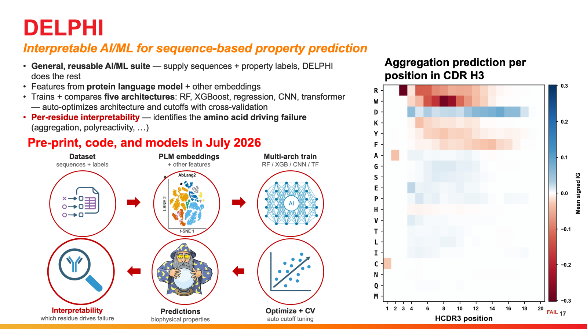
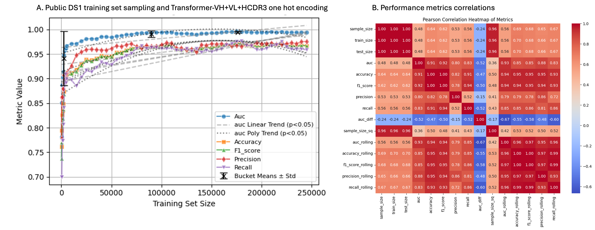
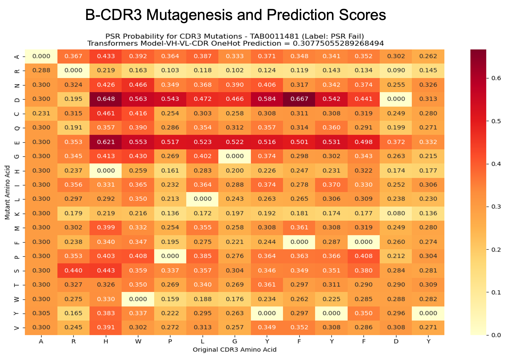
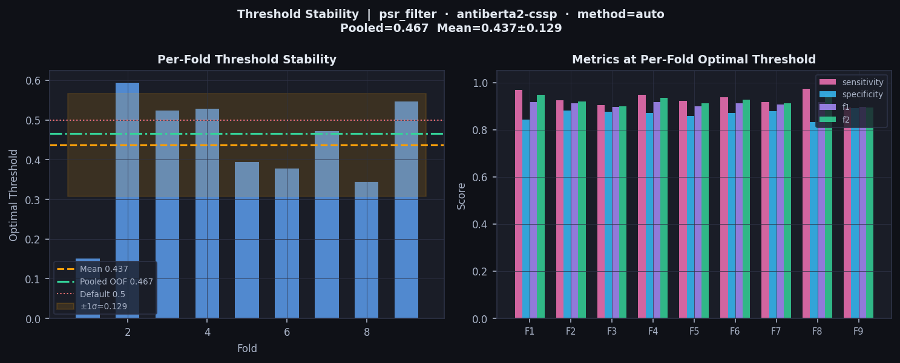
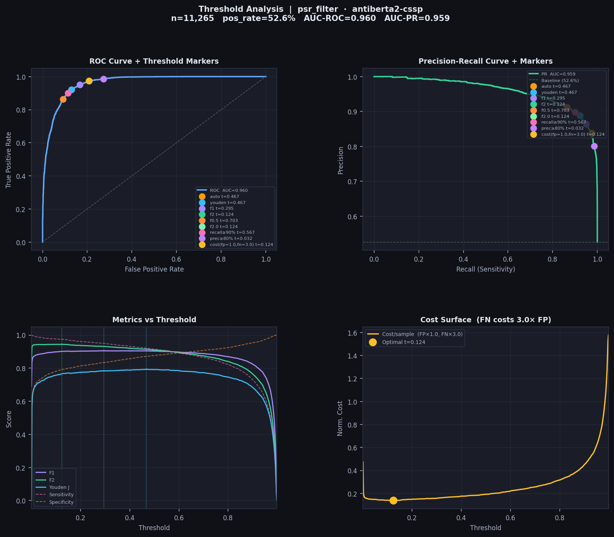

# DELPHI: Deep End-to-end Learning Platform for antibody developability with High Interpretability

<p align="center">
  
</p>

<p align="center">
  <a href="https://www.python.org/downloads/release/python-3110/"></a>
  <a href="https://pytorch.org/"></a>
  <a href="https://github.com/proteininnovation/delphi/blob/main/LICENSE"></a>
  <a href="https://github.com/proteininnovation/delphi"></a>
</p>

DELPHI is a unified interpretable machine learning framework for sequence-based prediction of antibody biophysical properties. It combines multiple classifier architectures, protein language model embeddings, automated training set curation, data-adaptive hyperparameter configuration, automated threshold optimisation, and multi-resolution interpretability within a single Python pipeline.

Applicable to any binary antibody property label including PSR (polyreactivity), SEC (size exclusion chromatography), HIC (hydrophobic interaction chromatography), AC-SINS (affinity capture self-interaction nanoparticle spectroscopy), viscosity, expression, and others.

> Code and full tutorial documentation accompanying the manuscript:
> **"DELPHI: a unified interpretable ML platform for multi-objective antibody developability prediction"**
> Hoan Nguyen, Andre Teixeira et al., *Nature Biotechnology* (in preparation)

---

## Table of Contents

- [Overview](#overview)
- [Installation](#installation)
- [Quick Start: Three Essential Steps](#quick-start-three-essential-steps)
  - [Step 1: Install Python environment and clone DELPHI](#step-1-install-python-environment-and-clone-delphi)
  - [Step 2: Download IPI pretrained models from Zenodo](#step-2-download-ipi-pretrained-models-from-zenodo)
  - [Step 3: Run the integration test suite](#step-3-run-the-integration-test-suite)
- [Using IPI Pretrained Models](#using-ipi-pretrained-models)
- [Training Your Own Models](#training-your-own-models)
  - [Step 0: Prepare your training set](#step-0-prepare-your-training-set)
  - [Step 1: Build a balanced training set (optional)](#step-1-build-a-balanced-training-set-optional)
  - [Step 2: Pre-compute embeddings](#step-2-pre-compute-embeddings)
  - [Step 3: Cross-validate](#step-3-cross-validate)
  - [Step 4: Train final model](#step-4-train-final-model)
- [Predict on New Antibodies](#predict-on-new-antibodies)
- [Correlate with Experimental Assays](#correlate-with-experimental-assays)
- [Interpretability Analysis](#interpretability-analysis)
- [Model Registry](#model-registry)
- [Supported Models and Embeddings](#supported-models-and-embeddings)
- [Data-Adaptive Hyperparameter Configuration](#data-adaptive-hyperparameter-configuration)
- [Key Results](#key-results)
- [Citation](#citation)
- [Contact](#contact)

---

## Overview


DELPHI is a unified interpretable machine learning platform for sequence-based prediction of antibody biophysical properties. It integrates five complementary capabilities within a single Python pipeline:

| Capability | Description |
|---|---|
| **Multiple ML architectures** | Transformer (one-hot and PLM), Random Forest, XGBoost, CNN — all in one CLI |
| **Multiple embeddings** | One-hot, biophysical descriptors, ABlang2, AntiBERTy, AntiBERTa2, IgBERT |
| **Training set curation** | Automated denoising via CDR3 clustering and OOF confidence filtering |
| **Data-adaptive configuration** | Model architecture and hyperparameters derived automatically from dataset size and class balance |
| **Multi-resolution interpretability** | SHAP (RF, XGBoost) and Integrated Gradients (Transformer) with per-residue CDR3 attribution |

**Two entry points:**

```
delphi.py                    — train, predict, correlate, build-dataset
delphi_interpretability.py   — publication-quality interpretability figures (SHAP, IG, CDR3 mutagenesis) 
```

---

## Installation

**Recommended: use the install script** — creates a dedicated `delphi` conda environment,
installs all dependencies (including HMMER, ANARCI, all PLMs), and pre-downloads IgBERT weights.

```bash
git clone https://github.com/proteininnovation/delphi.git
cd delphi
chmod +x install.sh
./install.sh
conda activate delphi
```

**Manual installation** (if you prefer step-by-step):

```bash
# 1. Clone
git clone https://github.com/proteininnovation/delphi.git
cd delphi

# 2. Create conda environment
conda create -n delphi python=3.11 -y
conda activate delphi

# 3. Install HMMER + ANARCI (explicit — do not rely on conda dependency resolution)
conda install -c bioconda hmmer anarci -y

# 4. Install all Python dependencies (includes all PLMs)
pip install -r requirements.txt
```

> **IgBERT** does not require a separate pip install. Its weights are downloaded
> automatically from HuggingFace Hub (`Exscientia/IgBert`) on first use.
> The install script pre-downloads them so tests run without internet access.

---

## Project Structure

```
delphi/
├── delphi.py                          # Main CLI: train, predict, correlate, build-dataset
├── delphi_interpretability.py         # Interpretability figure generator
├── install.sh                         # One-command environment setup
├── requirements.txt                   # All Python dependencies
├── config/
│   ├── model_registry.yaml            # Model registry (auto-updated by --train)
│   ├── transformer_onehot.yaml        # Hyperparameters for TransformerOneHot
│   ├── transformer_lm.yaml            # Hyperparameters for TransformerLM
│   ├── random_forest.yaml             # Hyperparameters for Random Forest
│   ├── xgboost.yaml                   # Hyperparameters for XGBoost
│   └── cnn.yaml                       # Hyperparameters for CNN
├── models/
│   ├── transformer_onehot.py          # Dual-branch Transformer + one-hot encoding
│   ├── transformer_lm.py              # Dual-branch Transformer + PLM embeddings
│   ├── random_forest.py               # Random Forest + SHAP interpretability
│   ├── xgboost.py                     # XGBoost + SHAP interpretability
│   └── cnn.py                         # 1D CNN + PLM embeddings
├── utils/
│   ├── build_balanced_dataset_v4.py   # Training set curation (CDR3 clustering + OOF filtering)
│   ├── threshold_optimizer.py         # Optimal classification threshold selection
│   ├── developability_correlation.py  # Assay correlation analysis and figures
│   ├── clustering.py                  # CDR3 Levenshtein clustering
│   ├── embedding_generator.py         # PLM embedding generation (ABlang2, AntiBERTy, IgBERT...)
│   ├── download_zenodo.py             # Download pretrained models from Zenodo  ← Step 2
│   ├── download_ds1_dataset.py        # Download and process DS1 public dataset
│   └── create_subsets.py              # Create CDR3-diverse balanced subsets
├── tests/
│   ├── test_delphi.py                 # Integration test suite  ← Step 3
│   ├── DS1_psr_500.xlsx               # Test data — 500 PSR antibodies (committed)
│   └── DS1_psr_5000.xlsx              # Larger test subset (committed)
├── data/                              # Training databases (gitignored)
└── pretrained_202605/                 # IPI pretrained models — download via Step 2
```

---

## Quick Start: Three Essential Steps

These three steps verify that DELPHI is correctly installed and all
pretrained models and interpretability tools are working.

---

### Step 1: Install Python environment and clone DELPHI

```bash
# Clone the repository
git clone https://github.com/proteininnovation/delphi.git
cd delphi

# Create a dedicated conda environment (Python 3.11)
# and install all dependencies including HMMER, ANARCI and all PLMs
chmod +x install.sh
./install.sh

# Activate the environment
conda activate delphi
```

The install script:
- Creates a `delphi` conda environment with Python 3.11
- Installs HMMER and ANARCI via conda (`conda install -c bioconda hmmer anarci`)
- Installs all Python packages via `pip install -r requirements.txt`
- Pre-downloads IgBERT weights from HuggingFace (`Exscientia/IgBert`)
- Prints `PASS` or `MISSING` for every required package

After `./install.sh` completes, your environment is fully ready.

---

### Step 2: Download IPI pretrained models from Zenodo

[](https://doi.org/10.5281/zenodo.20648372)

```bash
# Download all IPI pretrained models to pretrained_202605/
python utils/download_zenodo.py

# Preview what will be downloaded first (recommended)
python utils/download_zenodo.py --dry-run

# Download only PSR models
python utils/download_zenodo.py --filter psr_filter

# Download only SEC models
python utils/download_zenodo.py --filter sec_filter
```

This downloads all pretrained model files (`.pt` and `.pkl`) to
`pretrained_202605/`. The `config/model_registry.yaml` already
contains registry entries for all models pointing to this folder.

> Models are trained on proprietary IPI antibody datasets.
> Training sequences cannot be shared. Model weights are provided for
> inference only.

---

### Step 3: Run the integration test suite

```bash
# Full test suite (recommended)
python tests/test_delphi.py

# Fast mode — skips kfold (Test 4) and training (Test 5)
python tests/test_delphi.py --fast

# Run a single section
python tests/test_delphi.py --section 0   # package imports only
python tests/test_delphi.py --section 3   # prediction only
python tests/test_delphi.py --section 6   # interpretability only
```

The test data (`tests/DS1_psr_500.xlsx`, 500 antibodies from
Chen et al. 2024, MIT License) is committed to the repository —
no additional download needed.

**Test sections:**

| Section | What is tested |
|---|---|
| 0 | Package imports: PyTorch, SHAP, Captum, all PLMs |
| 1 | Test data: `DS1_psr_500.xlsx` — 500 antibodies, balanced 50-50 |
| 2 | Embedding generation: ABlang2, AntiBERTy, AntiBERTa2, IgBERT |
| 3 | PSR + SEC prediction using IPI pretrained models via `--model_id` |
| 4 | 10-fold cross-validation: transformer, RF, XGBoost |
| 5 | Train final models and verify model registry entry |
| 6 | Interpretability: SHAP + Integrated Gradients + per-antibody waterfall + CDR3 mutagenesis |

**Expected output when all tests pass:**

```
══════════════════════════════════════════════════════════════════
  SUMMARY
──────────────────────────────────────────────────────────────────
  PASS  Test 0: Package imports
  PASS  Test 1: Data file (DS1_psr_500.xlsx)
  PASS  Test 2: Embedding generation  (5 PLMs)
  PASS  Test 3: PSR + SEC prediction  (12 pretrained models)
  PASS  Test 4: 10-fold cross-validation  (4 models)
  PASS  Test 5: Build final models  (4 models)
  PASS  Test 6: Interpretability  (psr_filter, 500 samples)
──────────────────────────────────────────────────────────────────
  7 passed   0 failed
══════════════════════════════════════════════════════════════════
```

---

## Using IPI Pretrained Models

The fastest way to get started — no training data or GPU required.
IPI provides pretrained models for PSR, SEC, HIC, and AC-SINS.

**Download pretrained models** from Zenodo:

[](https://doi.org/10.5281/zenodo.20648372)

```bash
python utils/download_zenodo.py
```

Files download to `pretrained_202605/`. The `config/model_registry.yaml`
already contains registry entries for all models.

---

### Tutorial Step 1: Prepare your antibody file

Your input file must be an Excel (`.xlsx`) or CSV with these columns:

| Column | Description | Required |
|---|---|---|
| `BARCODE` | Unique antibody identifier | Yes |
| `HSEQ` | Full VH amino acid sequence | Yes |
| `LSEQ` | Full VL amino acid sequence | Yes |
| `CDR3` | HCDR3 sequence | Yes |

> **CDR3 convention:** CDR3 starts at the germline anchor (e.g. `AR...`),
> not the leading cysteine. Example: `ARGGPGYAVFDY`.

---

### Tutorial Step 2: Discover available models

```bash
# List all registered IPI pretrained models
python delphi.py --list-models

# Filter by target property
python delphi.py --list-models --target psr_filter
python delphi.py --list-models --target sec_filter
```

Example output:

```
model_id                                                               target       lm         model                type
──────────────────────────────────────────────────────────────────────────────────────────────────────────────────────
FINAL_psr_filter_onehot_transformer_onehot_ipi_psr_trainset.pt        psr_filter   onehot     transformer_onehot   full_train
FINAL_psr_filter_igbert_transformer_lm_ipi_psr_trainset.pt            psr_filter   igbert     transformer_lm       full_train
FINAL_psr_filter_biophysical_rf_ipi_psr_trainset.pkl                  psr_filter   biophs.    rf                   full_train
FINAL_psr_filter_biophysical_xgboost_ipi_psr_trainset.pkl             psr_filter   biophs.    xgboost              full_train
FINAL_sec_filter_onehot_transformer_onehot_ipi_sec_5000.pt            sec_filter   onehot     transformer_onehot   full_train
FINAL_sec_filter_igbert_transformer_lm_ipi_sec_5000.pt                sec_filter   igbert     transformer_lm       full_train
FINAL_sec_filter_biophysical_rf_ipi_sec_5000.pkl                      sec_filter   biophs.    rf                   full_train
FINAL_sec_filter_biophysical_xgboost_ipi_sec_5000.pkl                 sec_filter   biophs.    xgboost              full_train
```

---

### Tutorial Step 3: Predict on your antibodies

```bash
# Predict PSR (polyreactivity) — Transformer onehot model
python delphi.py --predict tests/DS1_psr_500.xlsx \
    --model_id FINAL_psr_filter_onehot_transformer_onehot_ipi_psr_trainset.pt \
    --outdir results/psr

# Predict SEC (size exclusion) — Transformer onehot model
python delphi.py --predict tests/DS1_psr_500.xlsx \
    --model_id FINAL_sec_filter_onehot_transformer_onehot_ipi_sec_5000.pt \
    --outdir results/sec

# Predict PSR using RF model instead
python delphi.py --predict tests/DS1_psr_500.xlsx \
    --model_id FINAL_psr_filter_biophysical_rf_ipi_psr_trainset.pkl \
    --outdir results/psr_rf
```

Output files written to `--outdir`:
```
tests/predictions/
    DS1_psr_500_psr_filter_predictions.xlsx    # BARCODE, score, label (PASS/FAIL)
    DS1_psr_500_psr_filter_predictions.csv
```

---


### Tutorial Step 4: Interpretability analysis

`delphi_interpretability.py` runs prediction internally — no separate
`--predict` step needed. One command loads the model, predicts, and
generates all figures.

```bash
# Single model, single filter — one command does everything
python delphi_interpretability.py \
    --target psr_filter \
    --model_id FINAL_psr_filter_onehot_transformer_onehot_ipi_psr_trainset.pt \
    --db tests/DS1_psr_500.xlsx \
    --outdir outputs/interp_psr

# Full analysis — all three models, PSR + SEC
python delphi_interpretability.py \
    --target psr_filter --target2 sec_filter \
    --db  tests/DS1_psr_500.xlsx \
    --db2 tests/DS1_psr_500.xlsx \
    --outdir outputs/interp_psr_sec
```

Output includes SHAP bar charts (RF, XGBoost), Integrated Gradients position
plots, HCDR3 residue heatmaps, and CDR3 in silico mutagenesis — all in
300 DPI TIFF/PDF/PNG format.

> `delphi.py --predict` is only needed when you want a standalone
> predictions file (CSV/Excel) to share or run `--correlate` against.

---

### Tutorial Step 5: Correlate with experimental assays (optional)

Compare DELPHI scores against your own experimental measurements:

```bash
# Discover score columns in the prediction file
python delphi.py --correlate tests/DS1_psr_500_psr_filter_predictions.xlsx \
    --target psr_filter --list-scores

# Correlate against a single assay
python delphi.py --correlate tests/DS1_psr_500_psr_filter_predictions.xlsx \
    --target psr_filter --assay psr_norm_smp \
    --outdir tests/psr_correlation

# Correlate against multiple assays
python delphi.py --correlate tests/DS1_psr_500_psr_filter_predictions.xlsx \
    --target psr_filter \
    --assay psr_norm_dna psr_norm_avidin psr_norm_smp \
    --outdir tests/psr_correlation
```


---

## Training Your Own Models

### Step 0: Prepare your training set

DELPHI expects an Excel or CSV file with the following columns:

| Column | Description | Required |
|---|---|---|
| `BARCODE` | Unique antibody identifier | Yes |
| `HSEQ` | Full VH sequence (amino acids) | Yes |
| `LSEQ` | Full VL sequence (amino acids) | Yes |
| `CDR3` | HCDR3 sequence (without leading C) | Yes |
| `psr_filter` | PSR label: 1=PASS, 0=FAIL | For PSR models |
| `sec_filter` | SEC label: 1=PASS, 0=FAIL | For SEC models |
| *any_property* | Any binary property: 1=PASS, 0=FAIL | Optional |

> **CDR3 convention:** CDR3 starts at the germline anchor (AR...), not the leading framework cysteine. Example: `...C | ARGGPGYAVFDY | WG...` — CDR3 = `ARGGPGYAVFDY`.

---

### Step 1: Build a balanced training set (optional)

This step is optional but recommended when your training data is imbalanced or contains noisy labels. You can skip directly to Step 2 and train on your raw data.

Run `--build-dataset` when:
- Your PASS/FAIL ratio is below 20% or above 80%
- You suspect mislabelled samples in the majority class
- You want to improve generalisation on external cohorts

```bash
# Recommended: combined strategy (CDR3 diversity + OOF confidence filtering)
python delphi.py --build-dataset tests/DS1_psr_500.xlsx \
    --target psr_filter --strategy combined --min-total 6000

# Cluster-only (diversity, fast)
python delphi.py --build-dataset tests/DS1_psr_500.xlsx \
    --target psr_filter --strategy cluster --cluster 0.8

# OOF consensus only (confidence filtering, stricter)
python delphi.py --build-dataset tests/DS1_psr_500.xlsx \
    --target psr_filter --strategy kmer_consensus --min-prob 0.7
```

**Output files** (if you ran `--build-dataset`):
```
tests/DS1_psr_500_psr_filter_balanced.xlsx        # balanced training set
tests/DS1_psr_500_psr_filter_imbalanced.xlsx       # imbalanced (natural ratio)
tests/DS1_psr_500_psr_filter_majority_rejected.xlsx
```

> If you skip this step, use your original file (`tests/DS1_psr_500.xlsx`) as `--db` in all subsequent commands.

<p align="center">
  
</p>

---

### Step 2: Pre-compute embeddings

For PLM-based models, embeddings are computed once and reused across all runs:

```bash
# IgBERT (1024-dim, recommended)
python delphi.py --build-embedding tests/DS1_psr_500.xlsx \
    --lm igbert

# ABlang2 (480-dim, fast)
python delphi.py --build-embedding tests/DS1_psr_500.xlsx \
    --lm ablang

# All supported PLMs at once
python delphi.py --build-embedding tests/DS1_psr_500.xlsx \
    --lm all
```

> For one-hot and biophysical models, skip this step — no embeddings needed.

---

### Step 3: Cross-validate

Cross-validation gives an honest AUC estimate and identifies the optimal epoch count for final training. Always run `--kfold` before `--train`.

```bash
# Transformer + one-hot (no PLM needed, recommended first model)
python delphi.py --kfold 10 \
    --target psr_filter --lm onehot --model transformer_onehot \
    --db tests/DS1_psr_500.xlsx

# Transformer + IgBERT (best AUC)
python delphi.py --kfold 10 \
    --target psr_filter --lm igbert --model transformer_lm \
    --db tests/DS1_psr_500.xlsx

# Random Forest + biophysical (fast baseline, interpretable)
python delphi.py --kfold 10 \
    --target psr_filter --lm biophysical --model rf \
    --db tests/DS1_psr_500.xlsx

# XGBoost + biophysical
python delphi.py --kfold 10 \
    --target psr_filter --lm biophysical --model xgboost \
    --db tests/DS1_psr_500.xlsx
```

At the end of `--kfold`, DELPHI prints:

```
  Mean best epoch across folds : 32  (±3.1)
  → Set in your YAML before running --train:
      training:
        epochs: 32
```

Set `epochs: 32` in the relevant YAML config, then proceed to training.

---

### Step 4: Train final model

Train on the full dataset using the epoch count from cross-validation. The model is automatically registered in `config/model_registry.yaml`.

```bash
# Transformer + one-hot
python delphi.py --train \
    --target psr_filter --lm onehot --model transformer_onehot \
    --db tests/DS1_psr_500.xlsx

# Transformer + IgBERT
python delphi.py --train \
    --target psr_filter --lm igbert --model transformer_lm \
    --db tests/DS1_psr_500.xlsx

# Random Forest
python delphi.py --train \
    --target psr_filter --lm biophysical --model rf \
    --db tests/DS1_psr_500.xlsx
```

After training, verify registration:

```bash
python delphi.py --list-models
python delphi.py --list-models --target psr_filter
```

---

## Predict on New Antibodies

```bash
# Auto-lookup from registry (uses most recent model for this target+lm+model)
python delphi.py --predict tests/DS1_psr_500.xlsx \
    --target psr_filter --lm onehot --model transformer_onehot

# Specify a model by registry ID
python delphi.py --predict tests/DS1_psr_500.xlsx \
    --model_id FINAL_psr_filter_onehot_transformer_onehot_ipi_psr_trainset.pt

# Specify explicit path
python delphi.py --predict tests/DS1_psr_500.xlsx \
    --model_path pretrained_202605/FINAL_psr_filter_onehot_transformer_onehot_ipi_psr_trainset.pt
```

---

## Correlate with Experimental Assays

Compare DELPHI scores against experimental measurements:

```bash
# Discover available score columns in the prediction file
python delphi.py --correlate tests/DS1_psr_500_psr_filter_predictions.xlsx \
    --target psr_filter --list-scores

# Single assay
python delphi.py --correlate tests/DS1_psr_500_psr_filter_predictions.xlsx \
    --target psr_filter --assay psr_norm_smp

# Multiple assays with logit transform
python delphi.py --correlate tests/DS1_psr_500_psr_filter_predictions.xlsx \
    --target psr_filter \
    --assay psr_norm_dna psr_norm_avidin psr_norm_smp \
    --logit-trans \
    --title "DELPHI PSR vs normalised PSR panel" \
    --outdir tests/psr_correlation
```

---

## Interpretability Analysis

Generate publication-quality SHAP and Integrated Gradients figures (Nature Biotechnology style).

**Minimum required models per filter:**

| Model | Embedding | File |
|---|---|---|
| Random Forest | biophysical | `FINAL_{target}_biophysical_rf_{db_stem}.pkl` |
| XGBoost | biophysical | `FINAL_{target}_biophysical_xgboost_{db_stem}.pkl` |
| Transformer | onehot | `FINAL_{target}_onehot_transformer_onehot_{db_stem}.pt` |

Missing models render their panel blank with a note — the script continues with available models.

```bash
# Full analysis: all models, PSR + SEC
python delphi_interpretability.py \
    --target psr_filter --target2 sec_filter \
    --db  tests/DS1_psr_500.xlsx \
    --db2 tests/DS1_psr_500.xlsx \
    --outdir outputs/interp_psr_sec

# Single model, single filter
python delphi_interpretability.py \
    --target psr_filter --models transformer_onehot \
    --db tests/DS1_psr_500.xlsx \
    --outdir outputs/interp_psr_transformer

# RF + Transformer only (skip XGBoost)
python delphi_interpretability.py \
    --target psr_filter --models rf transformer_onehot \
    --db tests/DS1_psr_500.xlsx \
    --outdir outputs/interp_psr_rf_tr

# Any label pair (not limited to PSR/SEC)
python delphi_interpretability.py \
    --target hic_filter --target2 acsins_filter \
    --db  tests/DS1_psr_500.xlsx \
    --db2 tests/DS1_psr_500.xlsx \
    --outdir outputs/interp_hic_acsins

# For final publication figures (all antibodies, high IG steps)
python delphi_interpretability.py \
    --target psr_filter --target2 sec_filter \
    --db  tests/DS1_psr_500.xlsx \
    --db2 tests/DS1_psr_500.xlsx \
    --max-samples 0 --ig-steps 1000 \
    --outdir outputs/interp_publication
```

If a required model is not found, DELPHI prints the exact command to train it:

```
  ┌─────────────────────────────────────────────────────────────┐
  │ rf (biophysical) not found for target=psr_filter            │
  │                                                             │
  │ To train this model, run:                                   │
  │                                                             │
  │   python delphi.py --train \                                │
  │       --target psr_filter \                                 │
  │       --lm biophysical --model rf \                         │
  │       --db tests/DS1_psr_500.xlsx      │
  │                                                             │
  │ Then re-run delphi_interpretability.py                      │
  └─────────────────────────────────────────────────────────────┘
```

<p align="center">
  
</p>

---

## Model Registry

DELPHI maintains a central model registry at `config/model_registry.yaml`. Every model trained with `--train` is automatically registered. The registry drives model lookup for `--predict`, `--correlate`, and `delphi_interpretability.py`.

```bash
# List all registered models
python delphi.py --list-models

# Filter by target
python delphi.py --list-models --target psr_filter

# Predict using registry auto-lookup (no --db needed after training)
python delphi.py --predict tests/DS1_psr_500.xlsx \
    --target psr_filter --lm onehot --model transformer_onehot

# Predict using a specific model_id
python delphi.py --predict tests/DS1_psr_500.xlsx \
    --model_id FINAL_psr_filter_onehot_transformer_onehot_ipi_psr_trainset.pt
```

**Example registry entry** (written automatically after `--train`):

```yaml
FINAL_psr_filter_onehot_transformer_onehot_ipi_psr_trainset.pt:
  trainset:        tests/DS1_psr_500.xlsx
  target:          psr_filter
  lm:              onehot
  model:           transformer_onehot
  model_path:      pretrained_202605/FINAL_psr_filter_onehot_transformer_onehot_ipi_psr_trainset.pt
  type:            full_train
  trained_at:      "2026-05-18 14:23:00"
  kfold_auc:       0.9341
  threshold:       0.4812
  epochs:          32
  notes:           ""
```

> Users can manually edit `model_id`, `model_path`, and `notes`. To register a best-fold checkpoint from `--kfold`, add an entry manually with `type: best_fold`.

---

## Supported Models and Embeddings

### ML architectures (`--model`)

| Model | Flag | Description | Interpretability |
|---|---|---|---|
| Transformer + one-hot | `transformer_onehot` | Dual-branch, no PLM needed | Integrated Gradients |
| Transformer + PLM | `transformer_lm` | Dual-branch, frozen/LoRA PLM | Integrated Gradients |
| Random Forest | `rf` | Fast, interpretable baseline | SHAP |
| XGBoost | `xgboost` | Gradient-boosted trees | SHAP |
| CNN | `cnn` | 1D convolutional, PLM input | SHAP |

### Embeddings (`--lm`)

| Embedding | Flag | Dimensions | PLM package |
|---|---|---|---|
| Biophysical descriptors | `biophysical` | 26 | None |
| K-mer frequencies | `kmer` | ~440 | None |
| One-hot (VH+VL) | `onehot` | 5,400 | None |
| One-hot (VH only) | `onehot_vh` | 2,700 | None |
| ABlang2 | `ablang` | 480 | `pip install ablang2` |
| AntiBERTy | `antiberty` | 512 | `pip install antiberty` |
| AntiBERTa2 | `antiberta2` | 1,024 | `pip install transformers` |
| IgBERT | `igbert` | 1,024 | `pip install transformers` (weights from HuggingFace Hub) |

---

## Data-Adaptive Hyperparameter Configuration

DELPHI automatically derives model architecture and training settings from dataset size and class balance at runtime using `mode: auto` in YAML config files. No manual tuning is required for new datasets or assay types.

```yaml
# config/transformer_onehot.yaml
mode: auto   # derives hidden_dim, num_layers, batch_size, lr, loss_function
             # from n (dataset size) and positive_rate (class balance)
```

Size tiers for `transformer_onehot` auto mode:

| Dataset size | Hidden dim | Layers | Batch | Dropout |
|---|---|---|---|---|
| n < 5k | 64 | 4 | 16 | 0.40 |
| 5k to 20k | 64 | 4 | 64 | 0.30 |
| 20k to 80k | 192 | 6 | 64 | 0.20 |
| 80k to 200k | 256 | 8 | 128 | 0.15 |
| n > 200k | 256 | 8 | 256 | 0.10 |

Loss function is also auto-selected based on class balance: `ce` for balanced data, `weighted_ce` for mild imbalance, and `focal` for severe imbalance (<10% minority).

---

## Key Results

<p align="center">
  
</p>

<p align="center">
  
</p>

---

## Citation

If you use DELPHI in your research, please cite:

```
Hoan Nguyen, Andre Teixeira et al.
DELPHI: a unified interpretable ML platform for multi-objective antibody
developability prediction.
Nature Biotechnology, 2026 (in preparation).
```

---

## Contact

**Hoan Nguyen, PhD** — [Hoan.Nguyen@proteininnovation.org](mailto:Hoan.Nguyen@proteininnovation.org)

**Andre Teixeira** — [Andre.Teixeira@proteininnovation.org](mailto:Andre.Teixeira@proteininnovation.org)

Institute for Protein Innovation (IPI), Boston, MA, USA

[https://proteininnovation.org](https://proteininnovation.org)
